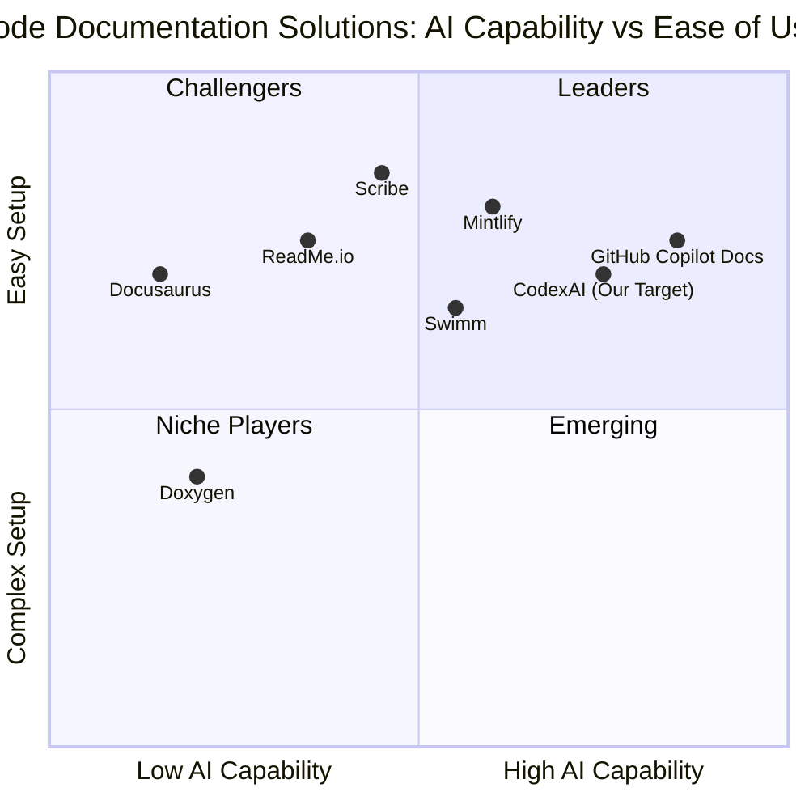
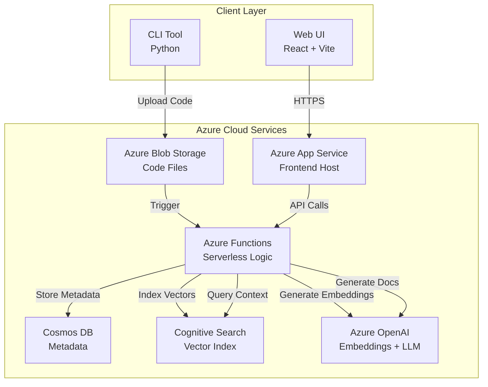
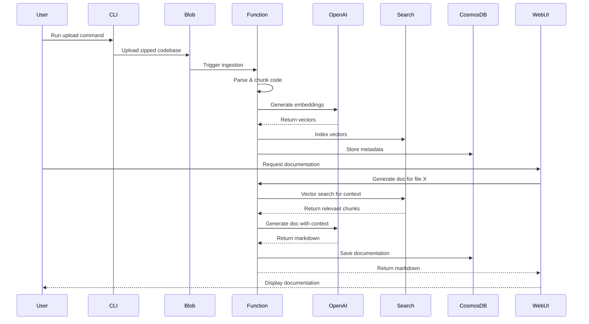

# Product Requirements Document: CodexAI

## 1. Language & Project Information

**Language:** English  
**Programming Language:** Python (Backend/CLI), TypeScript/React (Frontend)  
**Project Name:** codex_ai  
**Original Requirements:** Build CodexAI, a RAG-powered automated code documentation system that ingests local codebases, indexes them using vector embeddings, and allows users to generate high-context Markdown documentation via a web UI, utilizing Azure cloud services.

---

## 2. Product Definition

### 2.1 Product Goals

1. **Automate Code Documentation**: Eliminate manual documentation effort by automatically generating comprehensive, context-aware Markdown documentation for codebases using AI-powered analysis.

2. **Intelligent Context Retrieval**: Leverage RAG (Retrieval-Augmented Generation) architecture to provide accurate documentation by understanding code relationships, dependencies, and usage patterns across the entire codebase.

3. **Enterprise-Ready Cloud Solution**: Deliver a scalable, secure, and cost-efficient solution built on Azure services that can handle codebases of varying sizes while maintaining data confidentiality and compliance.

### 2.2 User Stories

1. **As a software developer**, I want to upload my local codebase through a CLI tool so that I can quickly index my project without manual file selection or complex configuration.

2. **As a technical lead**, I want to generate documentation for specific functions or files with relevant context so that new team members can understand the code's purpose and relationships without reading the entire codebase.

3. **As a documentation maintainer**, I want to browse uploaded files through a web interface and trigger documentation generation with one click so that I can efficiently create and update project documentation.

4. **As a DevOps engineer**, I want the system to automatically process code uploads and generate embeddings so that documentation stays synchronized with code changes without manual intervention.

5. **As a security-conscious organization**, I want all API keys and credentials managed through environment variables so that sensitive information never gets committed to version control or exposed in logs.

### 2.3 Competitive Analysis

1. **GitHub Copilot Docs (Preview)**
   - Pros: Deep GitHub integration, real-time suggestions, powered by OpenAI
   - Cons: Limited to GitHub ecosystem, no self-hosted option, expensive for large teams

2. **Mintlify**
   - Pros: Beautiful documentation UI, automatic API documentation, good developer experience
   - Cons: Primarily for API docs, limited code context understanding, SaaS-only model

3. **Swimm**
   - Pros: Continuous documentation, integrates with IDE, keeps docs synced with code
   - Cons: Requires manual doc creation initially, expensive enterprise pricing, limited AI capabilities

4. **Docusaurus + Manual Effort**
   - Pros: Free, highly customizable, static site generation, open-source
   - Cons: Completely manual documentation process, no AI assistance, time-consuming

5. **Doxygen**
   - Pros: Multi-language support, mature tool, generates comprehensive reference docs
   - Cons: Requires inline comments, no AI understanding, outdated UI, steep learning curve

6. **ReadMe.io**
   - Pros: Interactive API documentation, analytics, good UX
   - Cons: Manual content creation, focused on API docs only, subscription-based

7. **Scribe (getscribe.com)**
   - Pros: Auto-generates process documentation, screenshot capture, easy sharing
   - Cons: Not designed for code documentation, limited technical depth, no code analysis

### 2.4 Competitive Quadrant Chart



---

## 3. Technical Specifications

### 3.1 Requirements Analysis

CodexAI requires a robust, scalable architecture that combines modern cloud services with AI capabilities. The system must handle the complete lifecycle of code documentation: ingestion, processing, storage, retrieval, and generation.

**Key Technical Challenges:**

1. **Code Parsing & Chunking**: Intelligently split code into logical units (functions, classes, modules) while preserving context and relationships.

2. **Vector Search Optimization**: Balance between search accuracy and cost by optimizing embedding generation and retrieval strategies.

3. **Context Window Management**: Efficiently pack relevant context into LLM prompts while staying within token limits to control costs.

4. **Scalability**: Handle codebases ranging from small projects (100s of files) to enterprise repositories (10,000+ files).

5. **Security**: Ensure zero exposure of API keys, implement secure file handling, and maintain data isolation between users.

**Architecture Approach:**

- **Serverless-First**: Utilize Azure Functions for event-driven processing to minimize costs and maximize scalability.
- **Microservices Pattern**: Separate concerns into distinct services (ingestion, search, generation) for maintainability.
- **Asynchronous Processing**: Use message queues for long-running operations to improve user experience.
- **Caching Strategy**: Cache embeddings and frequently accessed documentation to reduce API calls.

### 3.2 Requirements Pool

#### P0 (Must-Have - MVP)

| Requirement ID | Description | Acceptance Criteria |
|---------------|-------------|---------------------|
| P0-1 | CLI tool for codebase upload | Must zip local directory, filter non-code files using .gitignore logic, and upload to Azure Blob Storage |
| P0-2 | Automated ingestion pipeline | Must trigger on blob upload, chunk code by logical blocks, generate embeddings, and store in Azure Cognitive Search |
| P0-3 | RAG inference engine | Must accept documentation requests, perform vector search, retrieve relevant context, and generate Markdown documentation |
| P0-4 | Web UI for file browsing | Must display uploaded files in a tree structure and provide "Generate Documentation" buttons |
| P0-5 | Environment-based configuration | Must use environment variables for all API keys and connection strings with zero hardcoded credentials |
| P0-6 | Azure OpenAI integration | Must use text-embedding-ada-002 for embeddings and gpt-4o-mini for documentation generation |
| P0-7 | Blob Storage integration | Must store uploaded code files and generated documentation in Azure Blob Storage |
| P0-8 | Cosmos DB metadata storage | Must store project metadata, file information, and processing status in Azure Cosmos DB |
| P0-9 | Token limit enforcement | Must limit context tokens sent to LLM to control costs (max 4000 tokens per request) |
| P0-10 | README documentation | Must include setup guide, Azure configuration, usage flow, and security warnings |

#### P1 (Should-Have - Post-MVP)

| Requirement ID | Description | Acceptance Criteria |
|---------------|-------------|---------------------|
| P1-1 | Multi-language support | Should support Python, JavaScript, TypeScript, Java, C#, Go, and Rust |
| P1-2 | Incremental updates | Should detect changed files and only re-process modified code |
| P1-3 | Documentation versioning | Should maintain version history of generated documentation |
| P1-4 | Batch documentation generation | Should allow generating documentation for entire projects or directories |
| P1-5 | Custom documentation templates | Should support user-defined documentation formats and styles |
| P1-6 | Search functionality | Should allow searching through generated documentation |
| P1-7 | Export options | Should support exporting documentation to PDF, HTML, and Markdown formats |
| P1-8 | Cost monitoring dashboard | Should display Azure service usage and estimated costs |

#### P2 (Nice-to-Have - Future)

| Requirement ID | Description | Acceptance Criteria |
|---------------|-------------|---------------------|
| P2-1 | IDE plugins | May provide VS Code and JetBrains IDE extensions |
| P2-2 | CI/CD integration | May integrate with GitHub Actions, Azure DevOps, and GitLab CI |
| P2-3 | Team collaboration features | May support comments, reviews, and approval workflows |
| P2-4 | Multi-tenant architecture | May support multiple organizations with data isolation |
| P2-5 | Custom LLM models | May allow using different LLM providers or self-hosted models |
| P2-6 | API documentation generation | May automatically generate OpenAPI/Swagger specs |
| P2-7 | Diagram generation | May create architecture diagrams and flowcharts from code |
| P2-8 | Natural language queries | May support asking questions about the codebase in natural language |

### 3.3 UI Design Draft

#### CLI Tool Interface

```
$ codexai upload ./my-project

CodexAI - Automated Code Documentation
=====================================

📁 Scanning directory: ./my-project
✓ Found 247 files
✓ Filtered to 189 code files (using .gitignore)
📦 Creating archive...
✓ Archive created: 2.3 MB

☁️  Uploading to Azure...
Progress: [████████████████████] 100%
✓ Upload complete

🔄 Triggering ingestion pipeline...
✓ Processing started (Job ID: abc-123-def)

✅ Done! Visit https://codexai.azurewebsites.net to view your project.
```

#### Web UI Layout

```
┌─────────────────────────────────────────────────────────────┐
│  CodexAI                                    [User] [Logout] │
├─────────────────────────────────────────────────────────────┤
│                                                               │
│  ┌─────────────────┐  ┌───────────────────────────────────┐ │
│  │ Projects        │  │  my-project/                      │ │
│  │                 │  │  ├── src/                         │ │
│  │ > my-project    │  │  │   ├── main.py    [Generate]   │ │
│  │   api-service   │  │  │   ├── utils.py   [Generate]   │ │
│  │   frontend-app  │  │  │   └── models/                 │ │
│  │                 │  │  │       ├── user.py [Generate]  │ │
│  │ [+ New Project] │  │  │       └── post.py [Generate]  │ │
│  │                 │  │  ├── tests/                       │ │
│  │                 │  │  └── README.md                    │ │
│  │                 │  │                                    │ │
│  │                 │  │  [Generate All Documentation]     │ │
│  │                 │  │                                    │ │
│  └─────────────────┘  └───────────────────────────────────┘ │
│                                                               │
│  Recent Activity                                             │
│  ────────────────────────────────────────────────────────── │
│  ✓ main.py documented (2 mins ago)                          │
│  ✓ utils.py documented (5 mins ago)                         │
│  🔄 models/user.py processing...                            │
│                                                               │
└─────────────────────────────────────────────────────────────┘
```

#### Documentation View

```
┌─────────────────────────────────────────────────────────────┐
│  ← Back to Files          main.py          [Regenerate] [⬇] │
├─────────────────────────────────────────────────────────────┤
│                                                               │
│  # main.py Documentation                                     │
│                                                               │
│  ## Overview                                                 │
│  This module serves as the entry point for the application. │
│  It initializes the FastAPI server and configures routes.   │
│                                                               │
│  ## Functions                                                │
│                                                               │
│  ### create_app()                                            │
│  **Purpose**: Initializes and configures the FastAPI app    │
│  **Returns**: FastAPI application instance                   │
│  **Dependencies**: utils.py, models/user.py                  │
│                                                               │
│  ### main()                                                  │
│  **Purpose**: Application entry point                        │
│  **Called by**: Direct execution                             │
│                                                               │
│  ## Related Files                                            │
│  - utils.py: Utility functions                               │
│  - models/user.py: User data model                           │
│  - tests/test_main.py: Unit tests                            │
│                                                               │
└─────────────────────────────────────────────────────────────┘
```

### 3.4 Open Questions

1. **Code Language Detection**: Should the system automatically detect programming languages, or require users to specify them during upload?

2. **Documentation Granularity**: What is the optimal level of detail for generated documentation? Should it document every function or focus on public APIs?

3. **Concurrent Processing**: How many files should be processed in parallel during ingestion to balance speed and cost?

4. **Embedding Model Selection**: Is text-embedding-ada-002 sufficient, or should we evaluate newer models like text-embedding-3-small for better performance?

5. **Authentication Strategy**: Should the system use Azure AD, social logins, or a custom authentication system?

6. **Rate Limiting**: What rate limits should be applied to prevent abuse and control costs?

7. **Retention Policy**: How long should uploaded code and generated documentation be retained? Should there be automatic cleanup?

8. **Error Handling**: How should the system handle malformed code, unsupported file types, or LLM generation failures?

---

## 4. System Architecture

### 4.1 High-Level Architecture



### 4.2 Data Flow



### 4.3 Component Specifications

#### CLI Tool (Python)
- **Purpose**: Upload local codebases to Azure
- **Key Features**: Directory scanning, .gitignore parsing, file filtering, compression, Azure SDK integration
- **Dependencies**: azure-storage-blob, python-dotenv, gitignore-parser

#### Azure Functions (Python)
- **Function 1: Ingestion Trigger**
  - Trigger: Blob upload event
  - Actions: Parse code, chunk, generate embeddings, index
  
- **Function 2: Documentation Generator**
  - Trigger: HTTP request
  - Actions: Vector search, context retrieval, LLM generation

- **Function 3: File Browser API**
  - Trigger: HTTP request
  - Actions: List files, retrieve metadata

#### Frontend (React + Vite)
- **Purpose**: User interface for browsing and generating documentation
- **Key Features**: File tree navigation, documentation viewer, generation triggers
- **Tech Stack**: React 18, TypeScript, Vite, TailwindCSS, React Query

#### Azure Cognitive Search
- **Index Schema**: 
  - id (string)
  - file_path (string)
  - chunk_content (string)
  - embedding (vector, 1536 dimensions)
  - language (string)
  - chunk_type (string: function/class/module)

#### Cosmos DB Schema
- **Container: projects**
  - id, name, upload_date, status, file_count
  
- **Container: files**
  - id, project_id, file_path, language, status, documentation_url

---

## 5. Non-Functional Requirements

### 5.1 Security Requirements

| Requirement | Description | Priority |
|------------|-------------|----------|
| SEC-1 | All API keys and connection strings MUST be stored in environment variables | P0 |
| SEC-2 | No credentials SHALL be hardcoded in source code or committed to version control | P0 |
| SEC-3 | Provide .env.template with placeholder values (e.g., REPLACE_WITH_YOUR_AZURE_KEY) | P0 |
| SEC-4 | Implement HTTPS-only communication for all services | P0 |
| SEC-5 | Use Azure Managed Identities where possible to eliminate credential management | P1 |
| SEC-6 | Implement input validation and sanitization for all user inputs | P0 |
| SEC-7 | Apply principle of least privilege for all Azure service permissions | P1 |
| SEC-8 | Implement rate limiting to prevent abuse | P1 |

### 5.2 Cost Efficiency Requirements

| Requirement | Description | Target |
|------------|-------------|--------|
| COST-1 | Limit context tokens sent to gpt-4o-mini to minimize API costs | Max 4000 tokens/request |
| COST-2 | Use Azure Functions Consumption Plan for serverless cost optimization | Pay-per-execution |
| COST-3 | Implement Cosmos DB in Serverless mode for variable workloads | Auto-scale |
| COST-4 | Use Azure Cognitive Search Basic Tier for MVP | $75/month |
| COST-5 | Cache embeddings to avoid regenerating for unchanged code | 90% cache hit rate |
| COST-6 | Implement smart chunking to minimize embedding API calls | <1000 chunks per project |
| COST-7 | Set budget alerts in Azure Cost Management | Alert at 80% threshold |

### 5.3 Performance Requirements

| Requirement | Description | Target |
|------------|-------------|--------|
| PERF-1 | CLI upload time for 100MB codebase | < 30 seconds |
| PERF-2 | Ingestion processing time for 1000 files | < 5 minutes |
| PERF-3 | Documentation generation time per file | < 10 seconds |
| PERF-4 | Web UI initial load time | < 2 seconds |
| PERF-5 | Vector search query latency | < 500ms |
| PERF-6 | API response time (95th percentile) | < 1 second |
| PERF-7 | Concurrent user support | 50 users |

### 5.4 Scalability Requirements

| Requirement | Description | Target |
|------------|-------------|--------|
| SCALE-1 | Support codebases up to 10,000 files | MVP: 1000 files |
| SCALE-2 | Handle concurrent documentation generation requests | 10 concurrent |
| SCALE-3 | Azure Functions auto-scaling | 0-200 instances |
| SCALE-4 | Cosmos DB throughput auto-scaling | 400-4000 RU/s |
| SCALE-5 | Blob Storage capacity | Unlimited |

### 5.5 Reliability Requirements

| Requirement | Description | Target |
|------------|-------------|--------|
| REL-1 | System uptime | 99.5% |
| REL-2 | Function execution success rate | 99% |
| REL-3 | Data durability (Blob Storage) | 99.999999999% |
| REL-4 | Automatic retry for transient failures | 3 retries with exponential backoff |
| REL-5 | Error logging and monitoring | 100% error capture |

### 5.6 Usability Requirements

| Requirement | Description | Priority |
|------------|-------------|----------|
| USE-1 | CLI tool must work with single command | P0 |
| USE-2 | Web UI must be intuitive without training | P0 |
| USE-3 | Provide comprehensive README with setup instructions | P0 |
| USE-4 | Error messages must be clear and actionable | P0 |
| USE-5 | Support common development workflows | P1 |

---

## 6. Technical Constraints & Dependencies

### 6.1 Technology Constraints

1. **Azure Cloud Platform**: System MUST be built entirely on Azure services (no AWS, GCP, or hybrid cloud).

2. **Python Backend**: Azure Functions and CLI tool MUST use Python 3.9+ for consistency.

3. **React Frontend**: Web UI MUST use React with Vite for optimal performance.

4. **Azure OpenAI**: MUST use Azure OpenAI service (not OpenAI API directly) for compliance and data residency.

5. **Serverless Architecture**: MUST use Azure Functions Consumption Plan (no dedicated compute).

### 6.2 Service Dependencies

| Service | Purpose | Tier | Monthly Cost (Est.) |
|---------|---------|------|---------------------|
| Azure App Service | Frontend hosting | Basic B1 | $13 |
| Azure Functions | Serverless compute | Consumption | $0-20 |
| Azure Cosmos DB | Metadata storage | Serverless | $1-25 |
| Azure Blob Storage | File storage | Standard LRS | $1-5 |
| Azure Cognitive Search | Vector search | Basic | $75 |
| Azure OpenAI | Embeddings + LLM | Pay-per-token | $10-50 |
| **Total** | | | **$100-188/month** |

### 6.3 External Dependencies

- **Python Libraries**: azure-functions, azure-storage-blob, azure-cosmos, openai, langchain
- **Node Packages**: react, vite, @azure/storage-blob, axios, react-query
- **Development Tools**: Azure CLI, Python 3.9+, Node.js 18+, Git

### 6.4 Environment Requirements

**Development Environment:**
- Python 3.9 or higher
- Node.js 18 or higher
- Azure CLI installed and configured
- Git for version control
- VS Code (recommended) with Azure extensions

**Azure Resources Required:**
- Active Azure subscription
- Resource group created
- Azure OpenAI service access (requires application approval)
- Sufficient quota for all services

---

## 7. Success Metrics

### 7.1 User Adoption Metrics

| Metric | Target (3 months) | Measurement Method |
|--------|-------------------|-------------------|
| Active Users | 50 users | Azure AD sign-ins |
| Projects Uploaded | 100 projects | Cosmos DB count |
| Documentation Generated | 5,000 files | Function execution logs |
| User Retention Rate | 60% | Monthly active users |
| Average Session Duration | 10 minutes | Application Insights |

### 7.2 Technical Performance Metrics

| Metric | Target | Measurement Method |
|--------|--------|-------------------|
| System Uptime | 99.5% | Azure Monitor |
| Average Generation Time | <10 seconds | Application Insights |
| API Error Rate | <1% | Function logs |
| Vector Search Accuracy | >85% relevance | User feedback |
| Cost per Documentation | <$0.05 | Azure Cost Management |

### 7.3 Quality Metrics

| Metric | Target | Measurement Method |
|--------|--------|-------------------|
| Documentation Accuracy | >80% user satisfaction | User surveys |
| Code Coverage (Tests) | >70% | pytest coverage |
| Security Vulnerabilities | 0 critical | Azure Security Center |
| Documentation Completeness | >90% functions documented | Automated analysis |

### 7.4 Business Metrics

| Metric | Target (6 months) | Measurement Method |
|--------|-------------------|-------------------|
| Cost per User | <$5/month | Azure billing |
| Time Saved vs Manual | 80% reduction | User surveys |
| Documentation Quality Score | 4/5 stars | User ratings |
| Support Ticket Volume | <10/month | Support system |

---

## 8. Delivery Checklist

### 8.1 Source Code Deliverables

- [ ] `/cli` - Python CLI tool with upload functionality
- [ ] `/backend` - Azure Functions for ingestion, search, and generation
- [ ] `/frontend` - React web application with Vite
- [ ] `/infrastructure` - Azure resource deployment scripts (optional)
- [ ] `.env.template` - Environment variable template with placeholders
- [ ] `.gitignore` - Comprehensive ignore rules including .env
- [ ] `requirements.txt` - Python dependencies
- [ ] `package.json` - Node.js dependencies

### 8.2 Documentation Deliverables

- [ ] `README.md` - Comprehensive setup and usage guide
  - [ ] Prerequisites section
  - [ ] Installation instructions
  - [ ] Azure configuration guide with all required environment variables
  - [ ] Usage examples for CLI and Web UI
  - [ ] **Bold security warning** about .env file
  - [ ] Troubleshooting section
- [ ] `ARCHITECTURE.md` - System architecture documentation
- [ ] `API.md` - API endpoint documentation
- [ ] `DEPLOYMENT.md` - Azure deployment guide
- [ ] Inline code comments and docstrings

### 8.3 Testing Deliverables

- [ ] Unit tests for CLI tool
- [ ] Unit tests for Azure Functions
- [ ] Integration tests for RAG pipeline
- [ ] Frontend component tests
- [ ] End-to-end test scenarios

### 8.4 Security Deliverables

- [ ] Security audit checklist
- [ ] Credential management documentation
- [ ] HTTPS configuration guide
- [ ] Azure RBAC configuration

---

## 9. Implementation Phases

### Phase 1: Foundation (Week 1-2)
- Set up Azure resources
- Implement CLI upload tool
- Create basic blob storage integration
- Develop .env configuration system

### Phase 2: Core RAG Pipeline (Week 3-4)
- Implement code chunking logic
- Integrate Azure OpenAI embeddings
- Set up Azure Cognitive Search indexing
- Build ingestion Azure Function

### Phase 3: Documentation Generation (Week 5-6)
- Develop RAG inference engine
- Implement context retrieval
- Create documentation generation function
- Optimize prompt engineering

### Phase 4: Web UI (Week 7-8)
- Build React frontend
- Implement file browser
- Create documentation viewer
- Add generation triggers

### Phase 5: Testing & Optimization (Week 9-10)
- Comprehensive testing
- Performance optimization
- Cost optimization
- Security hardening

### Phase 6: Documentation & Launch (Week 11-12)
- Complete all documentation
- Create video tutorials
- Beta user testing
- Production deployment

---

## 10. Risk Assessment

| Risk | Probability | Impact | Mitigation Strategy |
|------|------------|--------|---------------------|
| Azure OpenAI quota limits | Medium | High | Request quota increase early, implement queuing |
| Cost overruns | Medium | High | Implement strict token limits, monitoring, alerts |
| Code parsing errors | High | Medium | Robust error handling, support multiple languages gradually |
| Vector search accuracy | Medium | Medium | Fine-tune chunking strategy, hybrid search |
| Security vulnerabilities | Low | Critical | Security audit, penetration testing, Azure Security Center |
| Performance bottlenecks | Medium | Medium | Load testing, caching, optimization |
| User adoption challenges | Medium | Medium | Comprehensive documentation, tutorials, support |

---

## 11. Appendix

### 11.1 Required Azure Environment Variables

```
# Azure OpenAI
AZURE_OPENAI_KEY=REPLACE_WITH_YOUR_AZURE_KEY
AZURE_OPENAI_ENDPOINT=REPLACE_WITH_YOUR_ENDPOINT
AZURE_OPENAI_EMBEDDING_DEPLOYMENT=text-embedding-ada-002
AZURE_OPENAI_CHAT_DEPLOYMENT=gpt-4o-mini

# Azure Cognitive Search
AZURE_COGNITIVE_SEARCH_ENDPOINT=REPLACE_WITH_YOUR_ENDPOINT
AZURE_COGNITIVE_SEARCH_KEY=REPLACE_WITH_YOUR_KEY
AZURE_COGNITIVE_SEARCH_INDEX_NAME=codex-index

# Azure Blob Storage
AZURE_STORAGE_CONNECTION_STRING=REPLACE_WITH_YOUR_CONNECTION_STRING
AZURE_STORAGE_CONTAINER_NAME=codebases

# Azure Cosmos DB
AZURE_COSMOS_ENDPOINT=REPLACE_WITH_YOUR_ENDPOINT
AZURE_COSMOS_KEY=REPLACE_WITH_YOUR_KEY
AZURE_COSMOS_DATABASE_NAME=codexai
```

### 11.2 Glossary

- **RAG**: Retrieval-Augmented Generation - AI technique combining information retrieval with text generation
- **Vector Embedding**: Numerical representation of text that captures semantic meaning
- **Chunking**: Process of splitting code into logical units for processing
- **Serverless**: Cloud computing model where the provider manages infrastructure
- **Cosmos DB**: Azure's globally distributed, multi-model database service
- **Azure Functions**: Event-driven serverless compute platform
- **Cognitive Search**: Azure's AI-powered search service with vector search capabilities

---

**Document Version:** 1.0  
**Last Updated:** 2026-01-09  
**Author:** Emma (Product Manager)  
**Status:** Approved for Development